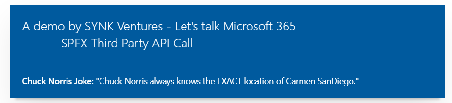

# Call a Third Party API in SPFx (SharePoint Development Framework)

## Summary

- Demonstrates how to call anonymous Third Party API from SPFx App. In this example it displays joke which is fetched from a Third Party API.
- More information here: https://youtu.be/E0IxARcTpcw

## Used SharePoint Framework Version

## Applies to

- [SharePoint Framework](https://aka.ms/spfx)
- [Microsoft 365 tenant](https://docs.microsoft.com/en-us/sharepoint/dev/spfx/set-up-your-developer-tenant)

> Get your own free development tenant by subscribing to [Microsoft 365 developer program](http://aka.ms/o365devprogram)

## Prerequisites

- Microsoft 365 Developer account
- Visual Studio code or any other IDE
- Node.js installed
- Git installation
- SPFx Development Set up https://docs.microsoft.com/en-us/sharepoint/dev/spfx/set-up-your-development-environment

## Solution

Solution|Author(s)
--------|---------
src | Author details (Kislay Sinha, CGI, https://twitter.com/SinhaKislay)

## Version history

Version|Date|Comments
-------|----|--------
1.0|January 05, 2021|Initial release

## Disclaimer

**THIS CODE IS PROVIDED *AS IS* WITHOUT WARRANTY OF ANY KIND, EITHER EXPRESS OR IMPLIED, INCLUDING ANY IMPLIED WARRANTIES OF FITNESS FOR A PARTICULAR PURPOSE, MERCHANTABILITY, OR NON-INFRINGEMENT.**

---

## Minimal Path to Awesome

- Clone this repository
- Ensure that you are at the solution folder
- in the command-line run:
  - **npm install**
  - **gulp serve**
  - Add the web part to workbench

> More information here https://youtu.be/E0IxARcTpcw

## Features

- Describes how to call a Third Party API using / consume REST APIs in SharePoint development framework
- Describes how to call anonymous API and display information in SharePoint SPFx web part
- The HttpClient API is used for making HTTP requests in SharePoint Framework . I have used HttpClient API to primarily submit anonymous requests to third-party APIs.
- React Framework is used for component to display the information

> Share your web part with others through Microsoft 365 Patterns and Practices program to get visibility and exposure. More details on the community, open-source projects and other activities from http://aka.ms/m365pnp.

## References

- [Getting started with SharePoint Framework](https://docs.microsoft.com/en-us/sharepoint/dev/spfx/set-up-your-developer-tenant)
- [Building for Microsoft teams](https://docs.microsoft.com/en-us/sharepoint/dev/spfx/build-for-teams-overview)
- [Use Microsoft Graph in your solution](https://docs.microsoft.com/en-us/sharepoint/dev/spfx/web-parts/get-started/using-microsoft-graph-apis)
- [Publish SharePoint Framework applications to the Marketplace](https://docs.microsoft.com/en-us/sharepoint/dev/spfx/publish-to-marketplace-overview)
- [Microsoft 365 Patterns and Practices](https://aka.ms/m365pnp) - Guidance, tooling, samples and open-source controls for your Microsoft 365 development
- https://youtu.be/E0IxARcTpcw
- https://github.com/sameerkumar18/geek-joke-api
